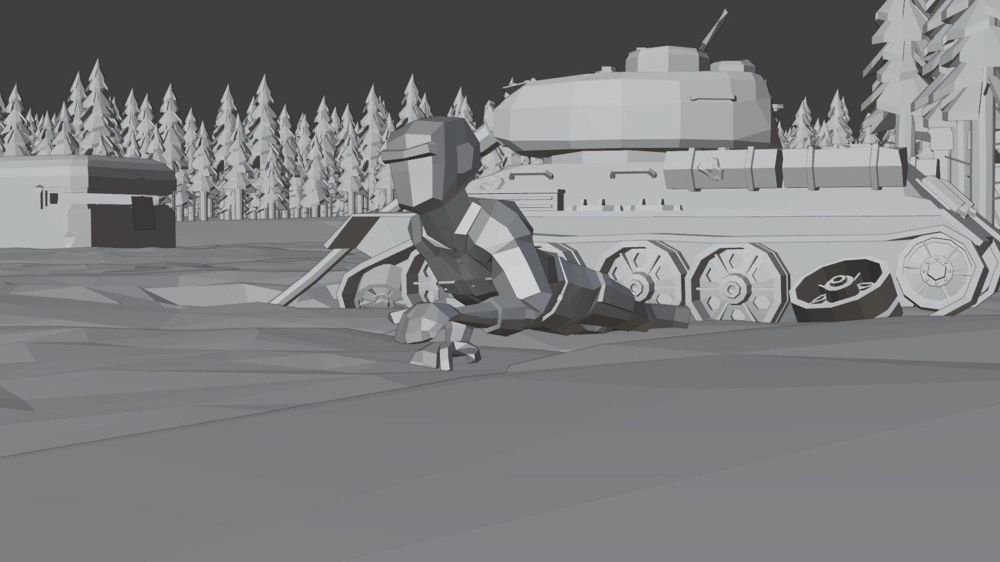
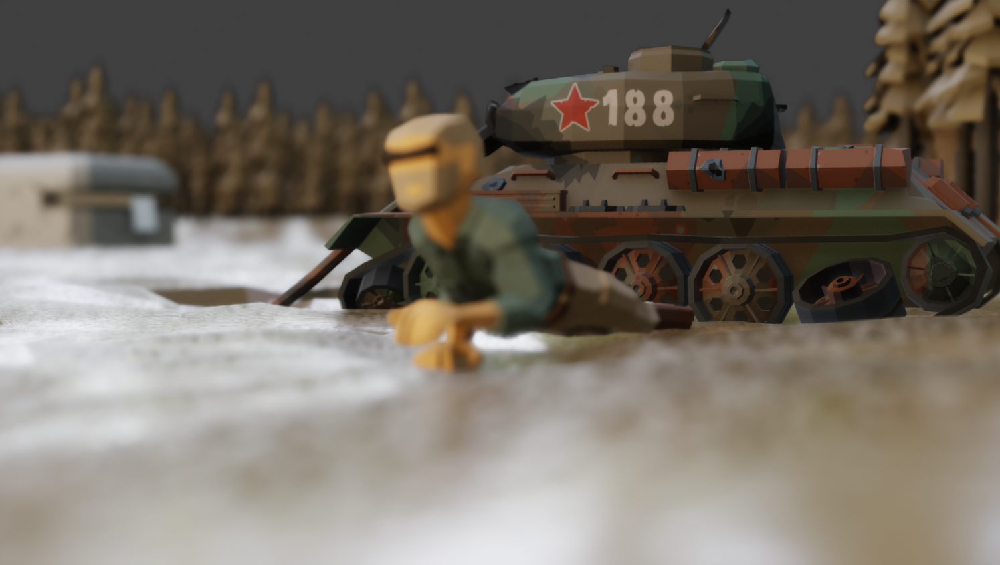
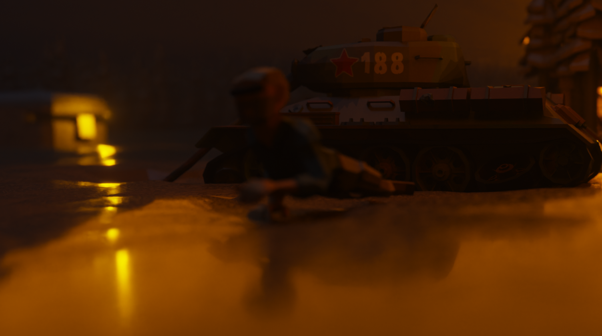
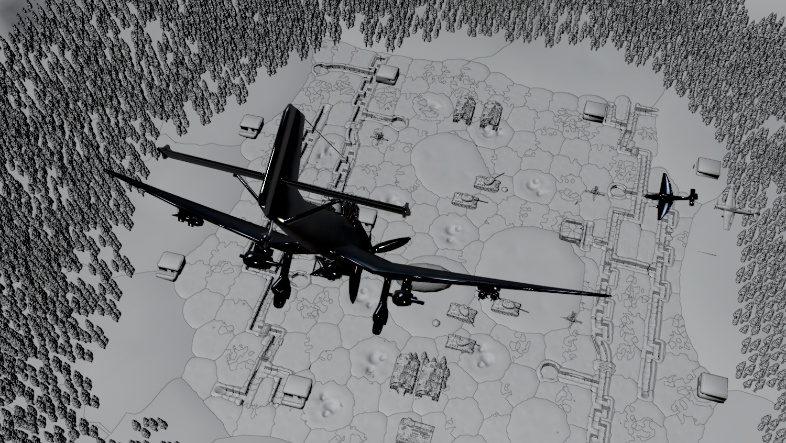
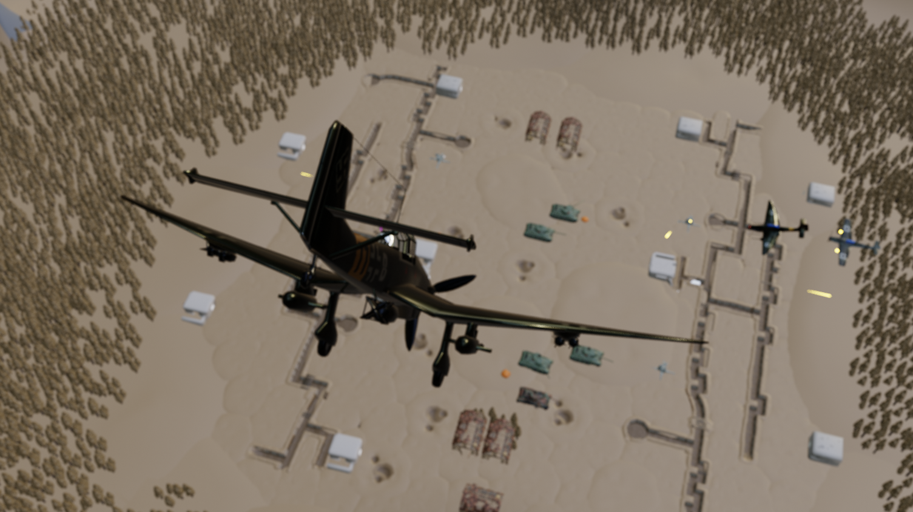
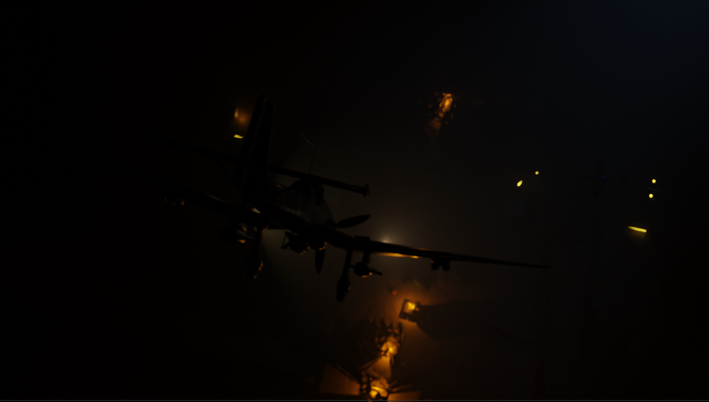

**Falling-souls**
---

## ▶️ Как запустить / просмотреть

 **Просмотр готовой анимации**:  
   Откройте `CutSceneBattle.mov` в любом видеоплеере.

---

## 🌟 Особенности реализации

- ✅ **Динамика падения самолёта** — Rigid Body Dynamics + ручная коррекция траектории для драматического эффекта  
- ✅ **Эмоциональный рендер лица** — Shape Keys + subtle eyeblink rig  
- ✅ **Пылевые шлейфы и огонь** — MantaFlow (smoke + fire) + volumetric lighting  
- ✅ **Цветокоррекция под «военную хронику»** — ACES + desaturation + vignette  
- ✅ **Real-time preview оптимизация** — Proxy mesh для симуляций, Viewport Denoising

<h1 align="center">Скриншоты из анимации в режимах Solid/Material preview/Rendered</h1>

---

## 💬 Вдохновение

- *«1917»* — Сэм Мендес (long-take эстетика, реализм травмы)  
- *«Война миров Z»* — сцена падения самолёта в Цинциннати  
- Исторические хроники ВОВ: архивные фото, письма с фронта  
- Музыка: *Max Richter — «On the Nature of Daylight»* (вдохновляла саунд-дизайн)

---

> ✅ Можно: смотреть, учиться, вдохновляться, ремиксить (с указанием автора).  
> ❌ Нельзя: коммерческое использование без согласования.

---

## 💌 Благодарности

Создано с ❤️ и уважением ко всем, кого коснулась война.  
Особая благодарность учителям по 3D-графике и тем, кто помнит — что за каждым пикселем может быть история.

---

> *«Мы не помним войны. Мы помним тех, кто в неё не вернулся.»*  
> — `falling-souls`, 2025

---
